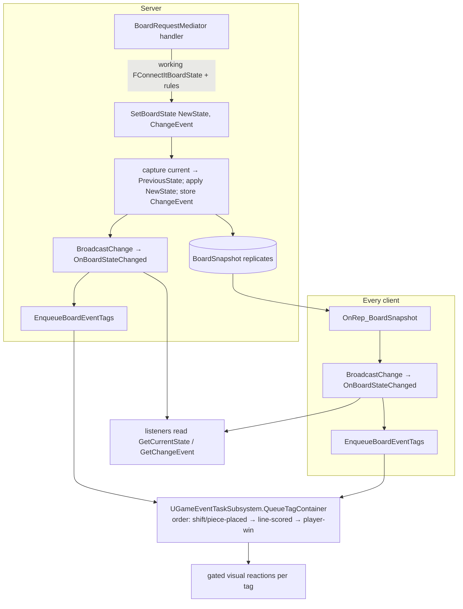

# Board state — single source of truth

## What happens

The entire board is one replicated property:
`FConnectItBoardStateSnapshot BoardSnapshot` on
[[UConnectIt_BoardStateComponent|UConnectIt_BoardStateComponent]] (which lives
on the replicated [[AConnectIt_GameState|AConnectIt_GameState]]). The snapshot
carries **previous state + current state + a `FConnectItBoardChangeEvent`** describing the
delta — so a listener always has both "what it is now" and "what just changed," delivered
atomically. The server mutates only through `SetBoardState`; clients receive
`OnRep_BoardSnapshot`. Both paths then call `BroadcastChange()` (the zero-param
`OnBoardStateChanged`) and `EnqueueBoardEventTags()` — identical code on both machines —
so visual sequencing is derived from the same data everywhere, not fired ad hoc from
server-only handlers.

## Diagram

## Steps

1. Server handler builds a working `FConnectItBoardState`, runs
   [[UConnectIt_BoardRules|rules]], assembles `FConnectItBoardChangeEvent`.
2. `SetBoardState(NewState, ChangeEvent)` — current→`PreviousState`, apply `NewState`,
   store `ChangeEvent` inside the one snapshot.
3. Snapshot replicates. `OnRep_BoardSnapshot` on clients.
4. Both machines: `BroadcastChange()` (zero-param) → listeners call `GetCurrentState()` /
   `GetChangeEvent()` for payload.
5. Both machines: `EnqueueBoardEventTags()` reads `ChangeEvent` and fires one
   `QueueTagContainer` per event flag set, in fixed order.

## Gotchas

- **Never write `CurrentState` directly** — only `SetBoardState`.
- The `OnBoardStateChanged` delegate carries **no parameters** by design — data comes from
  `GetChangeEvent()` (so debug widgets and gameplay bind the same signal).
- `EnqueueBoardEventTags` runs client-side too — anything it triggers must be safe to run
  without server authority and idempotent.
- `bGameWon` (event) is edge-triggered; `bGameOver` (state) latches.
- `TMap` can't replicate → `FConnectItBoardState` uses parallel `TilePositions` /
  `TileDataArray`; the change event uses flat arrays for the same reason.
- Ported from a deprecated `UConnectIt_BoardSequencerComponent` that derived the tag list
  separately — if you see that name, it's the old path.

## Cross-impact

Every UI reader (`AConnectIt_GameState` wrappers, `UConnectIt_BoardStateLibrary`, the
`UDWidget_ConnectIt_*`), the MinMax AI (builds hypothetical `FConnectItBoardState`s), and
`EnqueueBoardEventTags` all depend on this shape. A new change kind = new
`FConnectItBoardChangeEvent` fields + an `EnqueueBoardEventTags` branch + a tag.

## See also

- In-repo: [[ConnectIt/CLAUDE|ConnectIt overview]].
- [[place-piece-request|systems/place-piece-request]]
