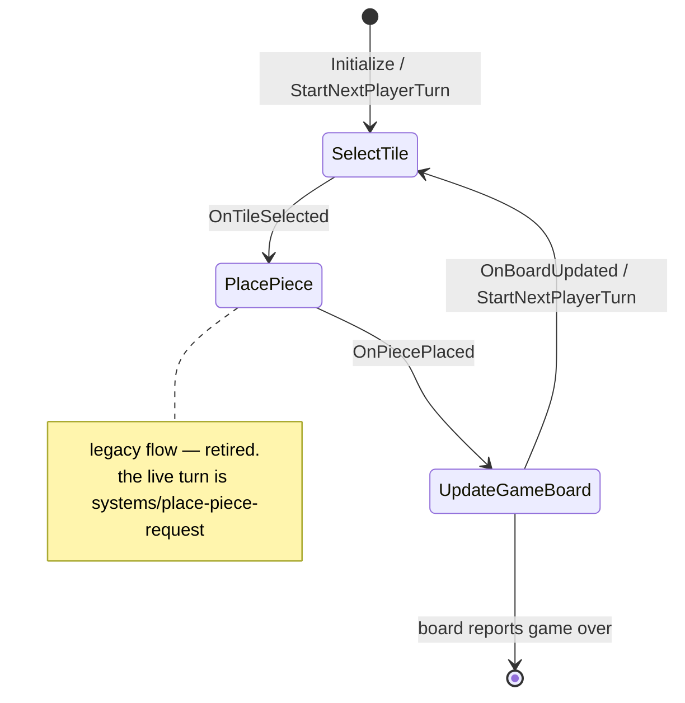

# Game state machine (retired legacy flow)

## What happens

> **This flow is not live.** It documents the shape of ConnectIt's original
> single-machine, non-networked turn loop, kept for the before/after contrast. No live
> code drives it — see [[UConnectIt_State_Game|UConnectIt_State_Game]] and
> [[ConnectIt/decisions/2026-09-08-retire-legacy-mvvm-pipeline|decisions/2026-09-08-retire-legacy-mvvm-pipeline]].

[[UConnectIt_State_Game|UConnectIt_State_Game]] was a composite single-state machine (on
`UnrealGameMechanics`' `UGameMechanicsStateSimple` + `IGameStateHandlerInterface`) that
modelled one player's turn as three phases — **SelectTile → PlacePiece →
UpdateGameBoard** — then handed off to the next player. Each phase was a
`UConnectIt_State_Base` subclass with a `GameStateTag` and cached
[[UConnectIt_GameFacade|GameFacade / GameViewModel]]. Transitions were
BlueprintNativeEvents on the composite (`OnTileSelected`, `OnPiecePlaced`,
`OnBoardUpdated`, `StartNextPlayerTurn`); each change broadcast `OnGameStateChanged` with
the phase tag. It assumed it was the only copy of the truth running — which is exactly
why network play forced its replacement.

## Diagram

## Steps

*(Historical — how the legacy loop ran.)*

1. **Init** — `UConnectIt_State_Game::Create` + `Initialize`; `Construct…` hooks
   `NewObject` the three sub-states.
2. **SelectTile** (`UConnectIt_State_SelectTile`) — player picks a tile; `OnTileSelected`.
3. **PlacePiece** (`UConnectIt_State_PlacePiece`) — carries the tile forward; `OnPiecePlaced`.
4. **UpdateGameBoard** (`UConnectIt_State_UpdateGameBoard`) — a `Create()` factory only;
   `OnBoardUpdated`.
5. `StartNextPlayerTurn` → back to SelectTile; `GameTurnTracker` increments.
6. Each transition: `BroadCastGameState` → `OnGameStateChanged(PhaseTag)`.

## Gotchas

- Nothing constructs `UConnectIt_State_Game` in the live tree — do not use this flow as a
  reference for how a turn works today. Use
  [[place-piece-request|systems/place-piece-request]].
- `BoardManager` on `UConnectIt_State_Game` references an actor that no longer exists.

## Cross-impact

Deleting the legacy pipeline removes this flow entirely. See
[[UConnectIt_State_Game|UConnectIt_State_Game]] Cross-impact for the class list.

## See also

- Decision: [[ConnectIt/decisions/2026-09-08-retire-legacy-mvvm-pipeline|decisions/2026-09-08-retire-legacy-mvvm-pipeline]]
- Live turn: [[place-piece-request|systems/place-piece-request]]
- [[UConnectIt_State_Game|UConnectIt_State_Game]], [[UConnectIt_GameFacade|UConnectIt_GameFacade]]
