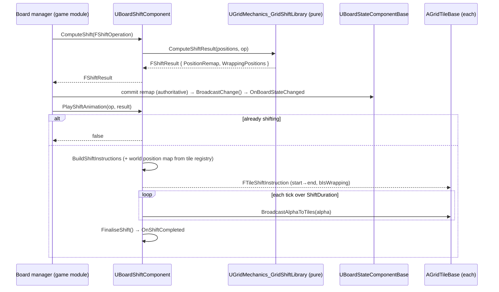

# Board shift

## What happens

A shift is described by an `FShiftOperation` (row/column, index, amount ≥ 1, direction).
[[UnrealGridMechanics/code/UBoardShiftComponent|UBoardShiftComponent]]`::ComputeShift`
turns it into an `FShiftResult` — a `PositionRemap` of every old→new cell plus the set of
cells that **wrapped** the edge — using pure math in `UGridMechanics_GridShiftLibrary`,
with no tile or world calls. The caller (the game's board manager) commits that remap
into `UBoardStateComponentBase` as the authoritative state, then hands the same
`FShiftResult` to `PlayShiftAnimation`, which builds a per-tile `FTileShiftInstruction`
(start/end world position, `bIsWrapping`), drives an alpha over `ShiftDuration`, and calls
`FinaliseShift` → `OnShiftCompleted`. Compute is truth; animate is cosmetic.

## Diagram

## Steps

1. **Compute:** `ComputeShift(Operation)` → `FShiftResult`
   (`UGridMechanics_GridShiftLibrary::ComputeShiftResult`; `ComputeShiftedPosition` /
   `IsWrapping` per cell).
2. **Commit:** the caller writes the remap into `UBoardStateComponentBase` (server), which
   calls `BroadcastChange()` → `OnBoardStateChanged` (and `OnRep` on clients).
3. **Animate:** `PlayShiftAnimation(Operation, Result)` — resolves tile actors + world
   positions from
   [[UnrealGridMechanics/code/UGridTileRegistryComponent|UGridTileRegistryComponent]],
   `BuildShiftInstructions`, fires `OnShiftStarted`.
4. **Tick:** `TickComponent` advances `ShiftAlpha`; `BroadcastAlphaToTiles` — each tile
   lerps `Start→End`, using `bIsWrapping` for a special wrap animation.
5. **Finalise:** `FinaliseShift()` → `OnShiftCompleted`.

## Gotchas

- **State is committed by the caller from the compute result**, not by the animation. If
  you skip step 2, the board desyncs from the visuals.
- `PlayShiftAnimation` returns `false` and does nothing if `IsShifting()` — don't fire a
  second shift mid-animation.
- `FShiftResult::PositionRemap` / `WrappingPositions` aren't `UPROPERTY` — no reflection.
- Tile animation is entirely tile-side; the component only broadcasts alpha + instructions.

## Cross-impact

Changing `FShiftResult` / `FTileShiftInstruction` shape touches
`UGridMechanics_GridShiftLibrary`, the game board manager (commit), and every tile actor's
animation code. This shift often runs *inside* a
[[UnrealGameMechanics/code/systems/gated-event-tag-queue|gated tag sequence]] so a turn waits
for it.

## See also

- [[UnrealGridMechanics/code/UBoardShiftComponent|UBoardShiftComponent]]
