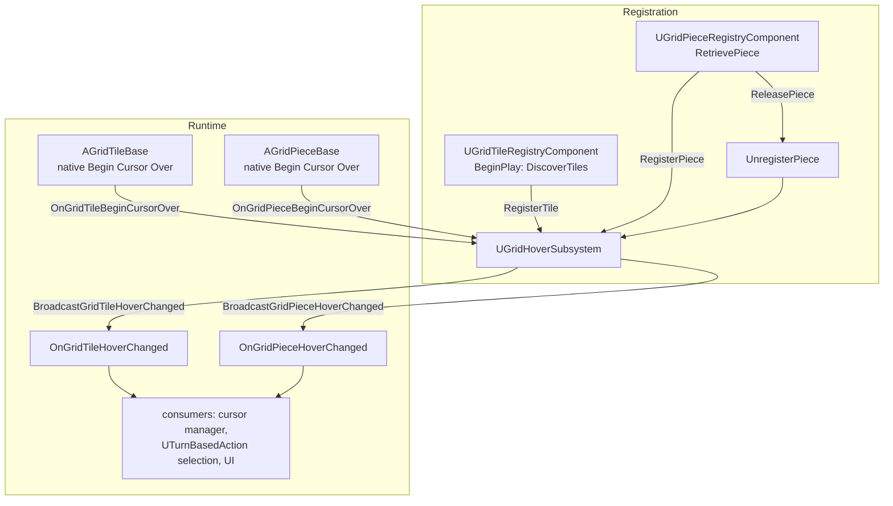

# Hover relay

## What happens

`UGridHoverSubsystem` gives consumers a **single** `OnGridTileHoverChanged` /
`OnGridPieceHoverChanged` delegate to bind, instead of every actor's own "Begin Cursor
Over". It does **no hit-testing** — each registered tile/piece broadcasts its own native
cursor-over event, and the subsystem chains those into the one relay delegate.
Registration is driven **only** by the registry components
([[UnrealGridMechanics/code/UGridTileRegistryComponent|tile]] /
[[UnrealGridMechanics/code/UGridPieceRegistryComponent|piece]]), never by the actors — so
a pooled, inactive piece is not registered and cannot fire hover.

## Diagram

## Steps

1. **Register tiles:** `UGridTileRegistryComponent::BeginPlay` → `DiscoverTiles` →
   `UGridHoverSubsystem::RegisterTile` for each (and for later-spawned ones via the
   `OnActorSpawned` handler).
2. **Register pieces:** `UGridPieceRegistryComponent::RetrievePiece` calls
   `RegisterPiece`; `ReleasePiece` calls `UnregisterPiece`. Inactive pooled pieces are
   never registered.
3. **Hover:** a registered actor's native "Begin Cursor Over" fires its own
   `OnGrid{Tile,Piece}BeginCursorOver`; the subsystem's `Broadcast…` UFUNCTION relays it
   as `OnGrid{Tile,Piece}HoverChanged`.
4. **Consume:** bind once to the subsystem delegate — e.g.
   [[UnrealTurnBasedMechanics/code/UTurnBasedAction|UTurnBasedAction]]'s selection
   pipeline, the cursor manager, tooltip UI.

## Gotchas

- **Only registered actors relay hover.** If a piece isn't showing hover, check it was
  `RetrievePiece`'d (registered), not just pool-activated.
- The subsystem doesn't hit-test or debounce — it forwards whatever the actors send.
- `UGridTrackerSubsystem` overlaps this subsystem's responsibility (known rough edge) —
  don't assume one is the sole source of hover state.
- Registration state lives in `TSet`s cleared on `Deinitialize` (world teardown).

## Cross-impact

Changing the relay delegate signatures touches the cursor managers, `UTurnBasedAction`
selection, and any UI bound to hover. Registration timing is coupled to the pool
lifecycle — see
[[UnrealGameMechanics/code/systems/actor-pooling-lifecycle|actor-pooling-lifecycle]].

## See also

- [[UnrealGridMechanics/code/UGridTileRegistryComponent|UGridTileRegistryComponent]],
  [[UnrealGridMechanics/code/UGridPieceRegistryComponent|UGridPieceRegistryComponent]] —
  the only registrars for the relay.
- [[UnrealGridMechanics/CLAUDE|UnrealGridMechanics overview]] → hover / tracker subsystems
  (and their overlap).
