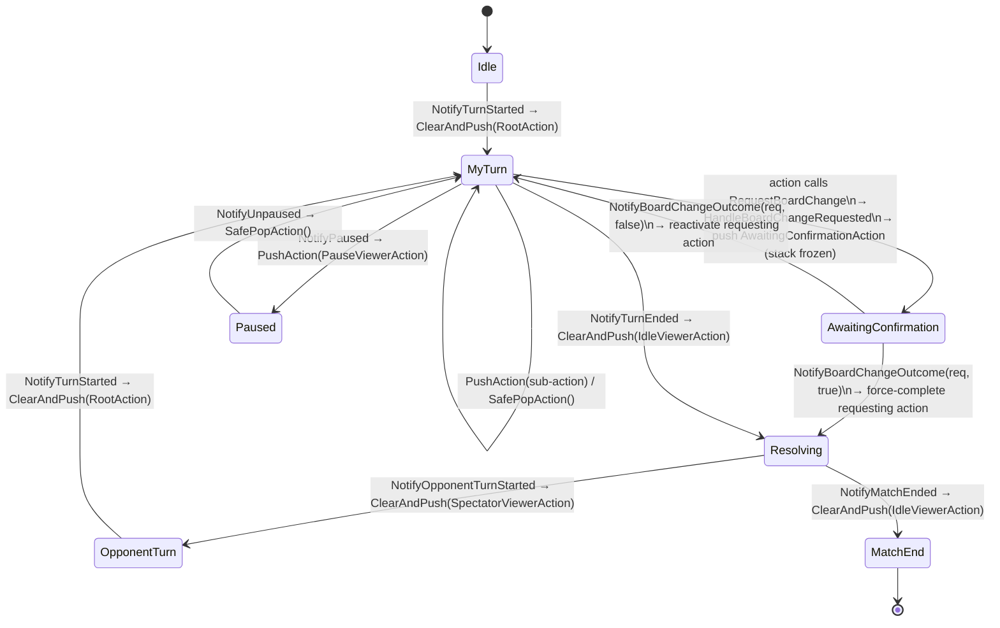

# Action stack lifecycle

## What happens

Each controller's moment-to-moment behaviour is the top entry of a stack owned by
[[UnrealTurnBasedMechanics/code/UTurnBasedActionsComponent|UTurnBasedActionsComponent]].
The stack is never empty (a mandatory root action sits at the bottom). Turn-lifecycle
`Notify*` calls reshape it with three primitives: **`PushAction`** (force-deactivate the
current top, don't pop, activate the new top), **`SafePopAction`** (pop unless it's the
last entry, reactivate whatever's below), **`ClearAndPush`** (tear the whole stack down,
install one new root). When the active player requests a board change, the component
pushes an *awaiting-confirmation* action and **freezes all stack mutation** until
`NotifyBoardChangeOutcome` arrives.

## Diagram

## Steps

1. **`InitialiseFromLoadout`** clones `Actions` and creates the five system-action
   instances from
   [[UnrealTurnBasedMechanics/code/UActionLoadoutDataAsset|UActionLoadoutDataAsset]].
2. **`NotifyTurnStarted(FTurnStartContext)`** → `OnTurnStarted` (designer override,
   default `ClearAndPush(RootAction)`); `TickCooldowns(true)`.
3. During the turn, an action chains via `RequestNextAction` → component `TryPushAction`;
   the player backs out via `CancelTopAction` / `SafePopAction`.
4. **Board change:** the action calls `RequestBoardChange(FTurnActionRequest)` →
   `OnChangeRequested` → `UTurnBasedActionsComponent::HandleBoardChangeRequested` sets
   `bAwaitingRequestConfirmation`, stores `PendingRequest`, pushes
   `AwaitingConfirmationAction`. `PushAction` / `SafePopAction` / `TryPushActionByRef` /
   `ClearAndPush` now refuse to run. The component re-broadcasts `OnBoardChangeRequested`
   for project glue to route to the server.
5. **`NotifyBoardChangeOutcome(Request, bSucceeded)`** — no-op unless `Request ==
   PendingRequest`. Clears the freeze first, then: on success force-completes the
   requesting action; on failure reactivates it for a retry.
6. **`NotifyTurnEnded`** → `ClearAndPush(IdleViewerAction)`; **`NotifyOpponentTurnStarted`**
   → `ClearAndPush(SpectatorViewerAction)`; **`NotifyPaused` / `NotifyUnpaused`** push/pop
   `PauseViewerAction` over the preserved stack; **`NotifyMatchEnded`** →
   `ClearAndPush(IdleViewerAction)`.
7. Auto-end: after an action completes, `CheckAutoEndTurn` → `CanAutoEndTurn()` (default:
   all `bIsRequired` actions have `CompletionsThisTurn > 0`) → `OnTurnEndReady` /
   `RequestTurnEnd` when `bAutoEndTurnOnAllRequiredActionsCompleted`.

## Gotchas

- **Stack never empties** — `SafePopAction` blocks the last pop; `RootActionClass` is
  mandatory.
- **The confirmation freeze is total** — a missing `NotifyBoardChangeOutcome` wedges the
  component with no timeout.
- `PushAction` force-deactivates the old top *without popping* — it's still on the stack
  and reactivates on pop.
- Observers (debug widgets) must bind `OnActionPushedSafe` / `…PoppedSafe` / `…CompletedSafe`
  / `…CancelledSafe` (copied `FTurnActionSnapshot`), not the raw-pointer originals.
- `CompletionsThisTurn` only moves on `Complete()`; `ResetTurnState` clears it at turn
  start.

## Cross-impact

Changing the primitives or `Notify*` set touches:
[[UnrealTurnBasedMechanics/code/UActionLoadoutDataAsset|UActionLoadoutDataAsset]] (slots),
`UTurnBasedControllerCoordinatorComponent` (caller),
`UDWidget_TurnBasedActionsComponent` + `FTurnBasedActionsComponentInfo` (observers),
[[UnrealTurnBasedMechanics/code/UTurnBasedActionBase|UTurnBasedActionBase]] /
[[UnrealTurnBasedMechanics/code/UTurnBasedAction|UTurnBasedAction]] lifecycle hooks.

## See also

- [[UnrealTurnBasedMechanics/code/systems/turn-end-tag-gate|turn-end-tag-gate]] (what "Resolving" waits on)
- [[UnrealTurnBasedMechanics/code/recipes/add-a-turn-action|recipes/add-a-turn-action]]
