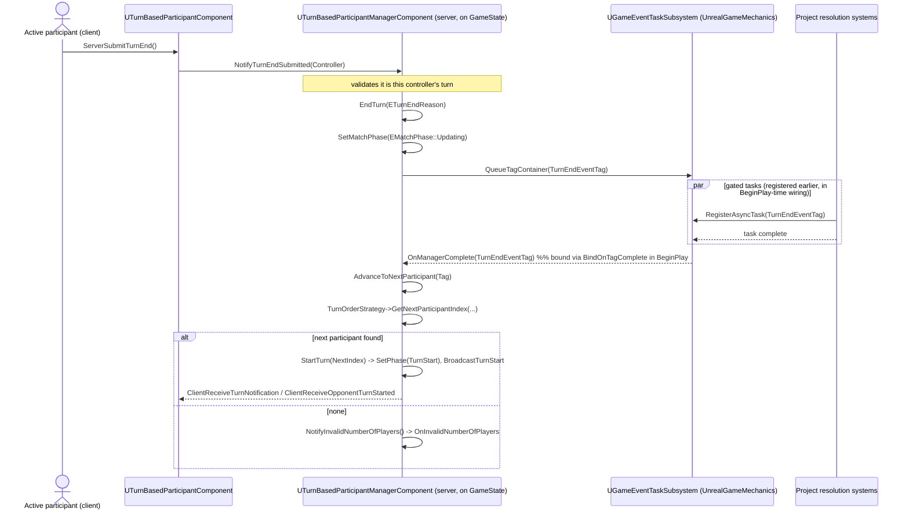

# Turn-end tag gate

## What happens

When the active participant submits turn end, the manager does **not** advance the match
immediately. It moves the match to a "resolving" state and queues a single project-set
gameplay tag (`TurnEndEventTag`) on UnrealGameMechanics' `UGameEventTaskSubsystem`. Any
project system (piece resolution, board shift animation, scoring) can have registered
gated async tasks against that tag. Only once **every** registered task reports complete
— or immediately, if none are registered — does the manager's `AdvanceToNextParticipant`
run and start the next turn. This replaced an earlier `BeginResolutionHold` /
`EndResolutionHold` counter API (itself a replacement for a fixed-duration timer); if you
see a "resolution hold counter" anywhere, it is describing retired code.

## Diagram

## Steps

1. **`UTurnBasedParticipantComponent::ServerSubmitTurnEnd()`** (client → server RPC).
2. **`UTurnBasedParticipantManagerComponent::NotifyTurnEndSubmitted(AController*)`** —
   server-only; validates against `IsActiveParticipant`.
3. **`EndTurn(ETurnEndReason)`** (private) — sets the match phase to
   `EMatchPhase::Updating` via `SetMatchPhase`, then queues `TurnEndEventTag` on the
   subsystem with `QueueTagContainer`.
4. **Gated tasks run.** Project systems that called `RegisterAsyncTask` against
   `TurnEndEventTag` execute; the subsystem waits for all to finish.
5. **`AdvanceToNextParticipant(FGameplayTag)`** — a `UFUNCTION` bound in `BeginPlay` as
   the tag's `BindOnTagComplete` handler. Runs once all tasks complete, or immediately
   (with an error logged) if `TurnEndEventTag` is unset.
6. It asks `TurnOrderStrategy` ([[UnrealTurnBasedMechanics/code/ITurnOrderInterface|ITurnOrderInterface]])
   for the next index, then `StartTurn` — or `NotifyInvalidNumberOfPlayers` if there is
   no valid next participant.

## Gotchas

- **`TurnEndEventTag` must be set by the project.** Unset ⇒ no gating, error logged,
  immediate advance.
- The gate is **server-side**; clients only observe the resulting phase/turn replication.
- `AdvanceToNextParticipant`'s `FGameplayTag` param is unused — it only ever binds to the
  one tag — but its signature must match `OnManagerComplete(FGameplayTag)` exactly
  (`BindUFunction` is not compile-time checked).
- A gated task that never reports complete **stalls the match** — there is no timeout on
  the gate itself.

## Cross-impact

- Adding a resolution step: register an async task against `TurnEndEventTag` from your
  system's init; nothing in the plugin changes.
- Renaming/removing `TurnEndEventTag`, or changing `EndTurn`'s phase: update
  [[UnrealTurnBasedMechanics/code/UTurnBasedParticipantManagerComponent|UTurnBasedParticipantManagerComponent]],
  `EMatchPhase`, `ATurnBasedGameState`, and any project system that queues/registers on
  the tag.

## See also

- In-repo: `old/Plugins/UnrealTurnBasedMechanics/Docs/Systems.md` → *Turn/Participant — the Match State Machine* (the
  "turn-end is gated by a gameplay tag" paragraph) and *Known Rough Edges*.
- UnrealGameMechanics `UGameEventTaskSubsystem` (`QueueTagContainer`, `RegisterAsyncTask`,
  `BindOnTagComplete`).
