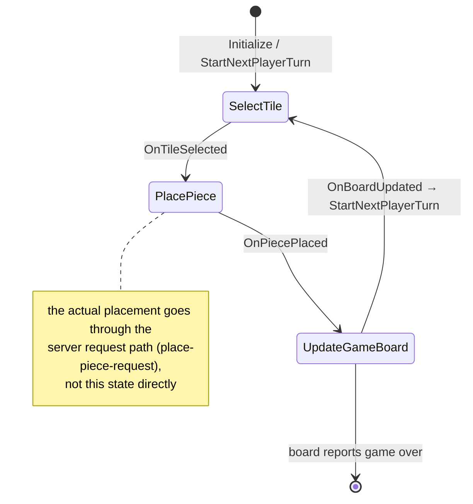

# Game state machine (per-turn phases)

## What happens

[[game/code/UConnectIt_State_Game|UConnectIt_State_Game]] is a composite single-state
machine (on `UnrealGameMechanics`' `UGameMechanicsStateSimple` +
`IGameStateHandlerInterface`) that models one player's turn as three phases:
**SelectTile → PlacePiece → UpdateGameBoard**, then hand off to the next player's turn.
Each phase is a `UConnectIt_State_Base` subclass with a `GameStateTag` and cached
[[game/code/UConnectIt_GameFacade|GameFacade / GameViewModel]]. Transitions are
BlueprintNativeEvents on the composite (`OnTileSelected`, `OnPiecePlaced`, `OnBoardUpdated`,
`StartNextPlayerTurn`), and every phase change broadcasts `OnGameStateChanged` with the
phase tag. This is the game's *local phase model* — the network-authoritative match state
is `UTurnBasedParticipantManagerComponent`.

## Diagram

## Steps

1. **Init** — `UConnectIt_State_Game::Create` + `Initialize`; `Construct…` hooks
   `NewObject` the three sub-states (`StateSelectTileClass` etc.).
2. **SelectTile** (`UConnectIt_State_SelectTile`) — player picks a tile; `OnTileSelected`.
3. **PlacePiece** (`UConnectIt_State_PlacePiece`) — drives placement; the real board
   mutation is the server request flow
   ([[game/systems/place-piece-request|place-piece-request]]); `OnPiecePlaced`.
4. **UpdateGameBoard** (`UConnectIt_State_UpdateGameBoard`) — waits for board update /
   gated visuals; `OnBoardUpdated`.
5. `StartNextPlayerTurn` → back to SelectTile for the next participant; `GameTurnTracker`
   increments.
6. Each transition: `BroadCastGameState` → `OnGameStateChanged(PhaseTag)`.

## Gotchas

- **`BoardManager` (`AConnectIt_BoardManager*`) on `UConnectIt_State_Game` is a legacy
  field** — that actor is retired; board authority is now
  `AConnectIt_GameMode` → `UConnectIt_BoardRequestMediator`. Expect stale wiring here
  pending cleanup.
- Don't treat this as the source of turn truth — that's
  `UTurnBasedParticipantManagerComponent` (replicated). This is a UI/flow convenience.
- Sub-state construction is via the `Construct…` BlueprintNativeEvents — override to swap
  a phase.

## Cross-impact

A new phase: `UConnectIt_State_*` subclass + `…Class` property + `Construct…` hook + a
transition event on `UConnectIt_State_Game` + a phase tag. Anything bound to
`OnGameStateChanged` must handle the new tag.

## See also

- In-repo: `Docs/README.md` → game state machine.
- `UnrealGameMechanics` `Docs/Systems.md` → single-state vs stacked state patterns.
